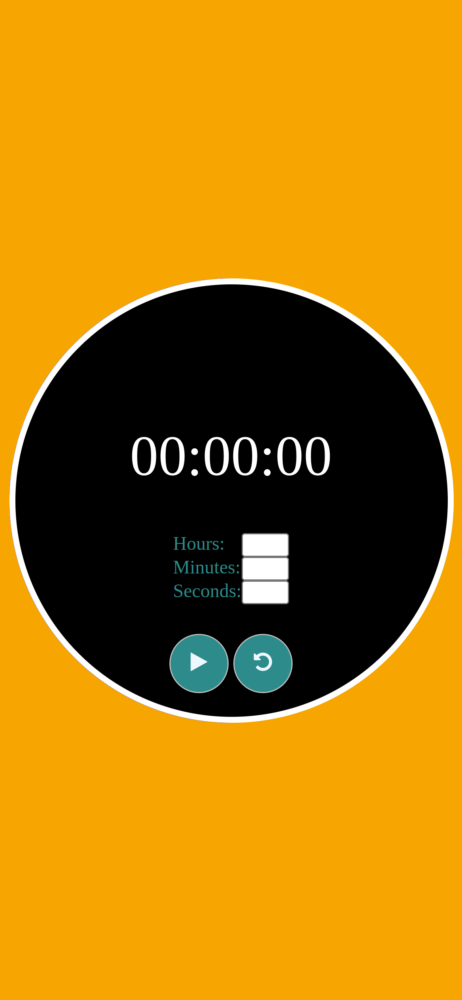

# JavaScript Pomodor Clock
## Table of contents

- [OverView](#):
  - In this project the first challenge was how should I make count down timer
  the second challenge was how should i make progress bar to work very well.

### Screenshot

<h1>Monitor View</h1>

<h1>Mobile View</h1>

## My process

### Built with

- Html5
- CSS
- Flexbox
- CSS Grid
- Mobile-first workflow
- JavaScript

### What I learned

I learned about were should i use Date.now() function, what is transition and transform in css 
and ... .

### Useful resources

- [Example resource 1](https://www.w3schools.com) - w3schools had a lot of document and content to how work with Html, Css, Bootstrap5 and JavaScript.
- [Example resource 2](https://www.youtube.com) - Also in youtube you can find a lot of content about how make Stop Timer.

## Author
- Mohammad Reza Dargi
